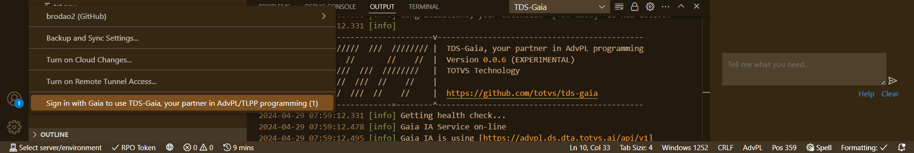
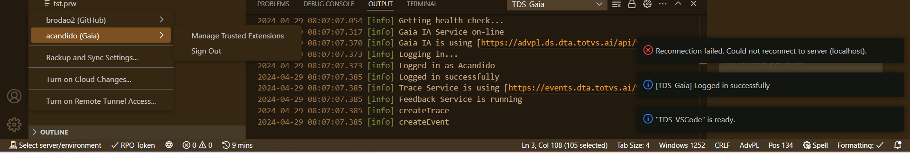

# TDS-Gaia, your partner in Advpl/TLPP Programming (**BETA**)

> **Do not use in production environments**, without carefully reviewing codes and explanations generated.
>
> Because it is a **beta** project, there is no guarantee that it works properly or is available for use full time.It can also have some delay, so have a little patience.
>
> At the moment, the service is **available** from **09h00** AS **17h00** on business days.

<!--

-->
<!-- prettier-ignore-start -->

<!-- markdownlint-disable -->
<!-- ALL-CONTRIBUTORS-BADGE:START - Do not remove or modify this section -->

<!-- ALL-CONTRIBUTORS-BADGE:END -->
<!-- markdownlint-enabled -->
<!-- prettier-ignore-end -->

The **TDS-Gaia** extension is an extension for [Visual Studio Code] (https://code.visualstudio.com/) which provides a visual interface for the AI service of ** Totvs **, which providesArtificial Intelligence Service to assist you in developing ADVPL/TLPP applications.

## Features (_status_)

:white_check_mark: Code complement
:white_check_mark: Code Explanation
:white_check_mark: Typification of variables
:white_check_mark: Code generation from a description
:white_square_button: Code analysis
:white_square_button: Automated translation of _STRINGS_

**Legendas**: 
:white_check_mark: BETA 
:walking: Ongoing, with no deadline 
:white_square_button: Under study (it can be canceled)

## Quick guide

> Suitable for those who are already familiar with ** vs-code **.Otherwise it is recommended to start:
>
> - [User Interface](https://code.visualstudio.com/docs/getstarted/userinterface)
> - [Settings](https://code.visualstudio.com/docs/getstarted/settings)
> - [Basic Edition](https://code.visualstudio.com/docs/editor/codebasics)
> - [Marketplace](https://code.visualstudio.com/docs/editor/extension-gallery)
> - [Instalação](README.md#instalação).

After the extension installation **TDS-Gaia**.A verification of AMA service availability is performed.
If everything is in order, identify yourself by doing `login`.After validated, open an ADVPL/TLPP source,
Position the cursor somewhere in the source, start typing Advpl/TLPP code or wait a few moments, which codes suggestions will be presented to you.

| Functionality  | Shortcut       | Action |
| -------------- | -------------- | ---- |
| Login           |               | Connects the user to the AI service.See [Authentication] (#Authentication) |
| Auto-completar  |               | Automatically triggered during edition. |
|                 |               | ** Tip: ** When the suggestion is presented position the _mouse_ about it to get a list of options.  |
| Explanation*     | Ctrl+D Ctrl+E | Explains the current or block line code. |
|                 | Ctrl+D Ctrl+W | Explains the word current (under the cursor). |
| Typification*    | Ctrl+D Ctrl+T | Typify variables of a function/method. |
| Generation Code* | Ctrl+D Ctrl+G | Code generation from a description selected in the current source. |

_* Functionalities still under development.Can take 1 minute or more to answer and present unexpected answers._

Read [features] (#features) for more details.

## Installation

> Requires the extension [** tds-vscode **] (/https://github.com/totvs/tds-vscode).If not, it will be installed automatically.Pay attention to the requirements of this extension.
>
> ** VS CODE ** can have problems in its features in line operating systems ** Windows Server **.
> See the requirements for use of ** vs code ** in [Requirements](https://code.visualstudio.comdocs/supporting/requirements).

### Searching for the extension (not available)

You can search and install extensions from within ** vs code **.Open the view of extensions by clicking on the extensions icon in the Activity Bar on the side of ** vs Code ** or trigger the "Vision: Extensions" command (`Ctrl+Shift+X`).

Then type `tds` in the search field and select the` TDS-Gaia` extension.

Practice the `Installation` button. After completing the installation, the `install` button will change to `manage`.

### Installing a VSIX file

You can manually install an extension of the ** vs code ** that has been packaged in a `.vsix` file.Use the VSIX `install command ...` In the view of extensions after triggering `display mode and more actions ...` (icon with "...") or trigger the command `Extensions: Install VSIX ...`In the command panel (` Ctrl+Shift+P`) and select the `.vsix` file.

Access [releases](https://github.com/totvs/TDS-Gaia/releases) to download the latest released version.

> If access is denied, request release.
> Your request will be analyzed and can be released or denied without further explanation.

You can also install using the `-Install-Extension` option through the command line and informing the` .vsix` file path.

> `code --install-extension TDS-Gaia-0.0.1.vsix`

At the end of the installation, a chat (_chat_) will be presented.It is through him that you and ** Gaia, your partner in the Advpl/TLPP ** programming, will interact.

> Tip: For better view, it is recommended to move the tab `TDS-Gaia` to the secondary panel (`Ctrl+Alt-B`).

### Reversing an update

If it is necessary to reverse an update, select the command `install another version ...` After triggering the `manage 'button and select the other version you want to install.

### Uninstalling the extension

To uninstall the extension, select the "Uninstall" command after triggering the "Manage" button.

## How to use

### Settings

The extension is already set ready for use, not requiring any additional settings.If you want to know more, go to [configuration] (docs/configuration.md).

### Authentication

#### Login

- Practice the authentication in **TDS-Gaia** (`Ctrl`+`Shift`+`P`, `TDS-Gaia: login`) or `accounts` (below) and acts` `sign in to TDS-Gaia ...` `
- Enter _Token_ Access. 

#### Disconnect (não é obrigatório)

- Practice the procedure in **TDS-Gaia** (`Ctrl`+`Shift`+`P`, `TDS-Gaia: logout`) or `accounts` (below)) and in your identification, trigger` `sign out``

### Starting to use

You can use the features through commands, which can be triggered in various ways.

- Triggering a shortcut;
- Triggering the command panel (`Ctrl`+`Shift`+`P` or` f1`), start typing the command to filter and activate it when located;
- Triggering links in chat;
- Typing the command by the chat prompt;
- Triggering the chat context menu or edition source. 

In this document, when quoted "trigger the command ...", understand that you can drive it through the shortcut to it, the command panel or typing it in the chat.If you type, type only the word informed between the finishing keys or trigger the shortcut between Releases.Remembering that the shortcuts mentioned here are those attributed by default.

For example: "... Identify yourself activating` TDS-Gaia: login [login] `", you can drive the command panel and locate the command or type `login` on _Prompt_ or trigger the connection to the chat,If it exists or even through the context menu of the chat or source in editing.

When the **TDS-Gaia**, answer in the chat that is ready to assist you, identify yourself activating `TDS-Gaia: login [login]`.

If you do not know what to do or look not working, see that the **TDS-Gaia** is telling you in the chat.

## Functionalities

## Code complement

The extension provides code suggestions by analyzing its code ADVPL/TLPP of the source being edited.To activate the complement, open an ADVPL/TLPP file, position the cursor at the desired location and type some code (or wait) and a list of possible add -ons will be displayed.

>The functionality can be configured to be activated [manually] (docs/configuration.md) or in a [waiting interval] (docs/configuration.md).

### Code Explanation

The extension can provide you with explanations about the code when triggering the `TDS-Gaia: Explain (Ctrl+D Ctrl+E) [Explain]`.
 If you are not satisfied, trigger the command again, which will be presented to you a new explanation.

#### Current line

Position the cursor on the line where you want an explanation and activate the command.

#### Current word

Position the cursor in the word which you want an explanation and activate the command.
Useful for obtaining explanations about functions and methods.

#### selected block

Select the code block from which you want an explanation and activate the command.

#### Function or method

Position the cursor in the header of the implementation of the function or method and trigger the command.

### Typification of variables

In TLPP codes, the extension can analyze a function or method and provide you with the typification of variables based on their use.With the cursor positioned anywhere within the function or method, trigger the `TDS-Gaia command: Typify (Ctrl+D Ctrl+T) [Typify]`.

## Common errors

### block by _firewall_ and other protection systems

The **TDS-Gaia** depends on access to URLs of external services that eventually need to be released by protection systems (_Firewalls_, Anti-Virus and others).

#### Symptom

It presents, in the `TDS-Gaia` view of the `output` tab, similar message:

`console
Cause: Error: unable to get local issuer certificate
Stack: TypeError: fetch failed
 at fetch (w:\ws_tds_vscode\TDS-Gaia\node_modules\undici\index.js:103:13)
 at process.processTicksAndRejections (node:internal/process/task_queues:95:5)
 at async CarolApi.checkHealth (w:\ws_tds_vscode\TDS-Gaia\out\api\carolApi.js:30:20)
`
#### Correction

Contact your company/organization security support so that it release access to URL `https: // advpl.dta.totvs.ai` or other _endpoint_ indicated.

Depending on settings from your operating system/work environment, you can release access yourself as long as you have the knowledge of how to make them.

## Extensions with incompatibility

Third-party extensions using artificial intelligence resources to support developers can interfere with the functioning of **TDS-Gaia**.If possible, [disable it] (https://code.visualstudio.com/docs/editor/extension-marketplace#_disable-an-extension) for ADVPL sources work areas to ignore these sources (see extension documentation).