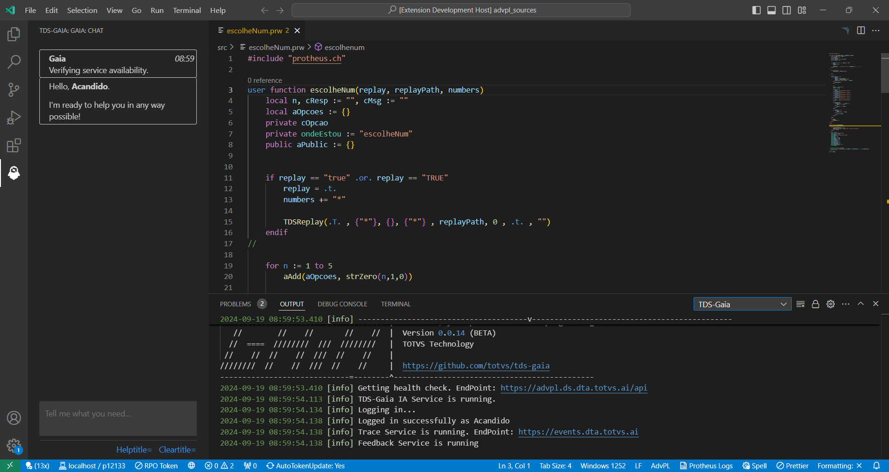

# TDS-Dito, seu "par" na programação AdvPL/TLPP (**EXPERIMENTAL**)

> **NÃO USE EM AMBIENTES DE PRODUÇÃO**, sem revisar cuidadosamente os códigos e explicações geradas.
>
> Por ser um projeto **experimental**, não há garantias de que ele funcione corretamente ou esteja disponível para uso em tempo integral. Também pode apresentar alguma demora, por isso tenha um pouco de paciência.
>
> No momento, o serviço está **disponível** das **09h00** as **17h00**, em dias úteis.

<!--

-->
<!-- prettier-ignore-start -->

<!-- markdownlint-disable -->
<!-- ALL-CONTRIBUTORS-BADGE:START - Do not remove or modify this section -->

<!-- ALL-CONTRIBUTORS-BADGE:END -->
<!-- markdownlint-enabled -->
<!-- prettier-ignore-end -->

A extensão **TDS-Dito** é uma extensão para o [Visual Studio Code](https://code.visualstudio.com/) que fornece uma interface visual para o serviço de IA da **TOTVS**, que provê serviço de inteligência artificial para ajudá-lo no desenvolvimento de aplicações AdvPL/TLPP.

## Funcionalidades (_status_)

:white_check_mark: Complemento de código
:white_check_mark: Explicação de código
:white_check_mark: Tipificação de variáveis
:walking: Geração de código a partir de uma descrição
:white_square_button: Análise de código
:white_square_button: Tradução automatizada de _strings_

**Legendas**: :white_check_mark: Experimental :walking: Em andamento, sem prazo :white_square_button: Em estudo (pode ser cancelado)

## Guia rápido

> Indicado para quem já tem familiaridade com o **VS-Code**. Caso contrário, recomenda-se começar:
>
> - [User Interface](https://code.visualstudio.com/docs/getstarted/userinterface)
> - [Settings](https://code.visualstudio.com/docs/getstarted/settings)
> - [Basic Edition](https://code.visualstudio.com/docs/editor/codebasics)
> - [Marketplace](https://code.visualstudio.com/docs/editor/extension-gallery)
> - [Instalação](README.md#instalação).

Após a instalação da extensão **TDS-Dito**. Uma verificação de disponibilidade do serviço de IA é efetuada. 
Se estiver tudo em ordem, identifique-se efetuando `Login [Ctrl+D Ctrl+E]`. Após validado, abra um fonte AdvPL/TLPP, 
posicione o cursor em algum local do fonte, comece a digitar código AdvPL/TLPP ou aguarde alguns instantes, que sugestões de códigos lhe serão apresentadas.

| Funcionalidade | Atalho        | Ação |
| -------------- | ------------- | ---- |
| Login          | Ctrl+D Ctrl+L | Apresenta o usuário ao IA. |
| Complemento    |               | Acionado automaticamente durante a edição. |
| Explicação*    | Ctrl+D Ctrl+E | Explica o código da linha corrente ou bloco. |
|                | Ctrl+D Ctrl+W | Explica a palavra corrente (sob o cursor). |
| Tipificação*   | Ctrl+D Ctrl+T | Tipifica variáveis de uma função/método. |

_* Funcionalidades ainda em desenvolvimento. Podem levar 1 minuto ou mais para responder e apresentar respostas inesperadas._

Leia [Funcionalidades](#funcionalidades), para saber maiores detalhes.

## Instalação

> Requer a extensão [**TDS-VSCode**](/https://github.com/totvs/tds-vscode). Caso não o tenha, este será instalado automaticamente. Atente-se ao requisitos desta extensão.
>
> O **VS Code** pode apresentar problemas em suas funcionalidades em sistemas operacionais da linha **Windows Server**.
> Veja os requisitos para uso do **VS Code** em [Requirements](https://code.visualstudio.comdocs/supporting/requirements).

### Procurando pela extensão (não disponível)

Você pode procurar e instalar extensões de dentro do **VS Code**. Abra a visão de extensões clicando no ícone de extensões na barra de atividades na lateral do **VS Code** ou acione o comando "Visão: Extensões" (`ctrl+shift+x`).

Em seguida digite `tds` no campo de pesquisa e selecione a extensão `TDS-Dito`.

Acione  o botão `Instalar`. Após completar a instalação, o botão `Instalar` será alterado para `Gerenciar`. 

### Instalando de um arquivo VSIX

Você pode instalar manualmente uma extensão do **VS Code** que foi empacotada em um arquivo `.vsix`. Utilize o comando `Instalar do VSIX...` na visão de extensões após acionar `Modo de Exibição e Mais Ações...` (ícone com "...") ou acione o comando `Extensões: Instalar do VSIX...` no painel de comandos (`CTRL+SHIFT+P`) e selecione o arquivo `.vsix`.

Acesse [releases](https://github.com/brodao2/tds-dito/releases) para baixar a última versão liberada.

> Caso o acesso seja negado, solicite liberação.
> Sua solicitação será analisada, podendo ser liberado ou negada sem maiores explicações.

Você pode instalar também usando a opção `--install-extension` através da linha de comando e informando o caminho do arquivo `.vsix`.

> `code --install-extension tds-dito-0.0.1.vsix`

Ao finalizar a instalação, lhe será apresentado um bate-bato (_chat_). É através dele que você e  **Dito, seu parceiro na programação AdvPL/TLPP**, iram interagir.

> DICA: Para melhor visualização, recomenda-se mover a aba `DITO` para o painel secundário (`Ctrl+Alt-B`).

### Revertendo uma atualização

Se for necessário reverter uma atualização, selecione o comando `Instalar Outra Versão...` após acionar o botão `Gerenciar` e selecione a outra versão que deseja instalar.

### Desinstalando a extensão

Para desinstalar a extensão, selecione o comando "Desinstalar" após acionar o botão "Gerenciar".

## Como usar

### Configuração

A extensão já vem configurada pronto para uso, não requerendo nenhuma configuração adicional. Caso queira saber mais, acesse [Configuração](docs/configuration.md).

### Começando a usar

Você pode utilizar  as funcionalidades através de comandos, que podem ser acionados de diversas formas. 

- Acionando um atalho;
- Acionando o painel de comandos (`ctrl+shit+p` ou `F1`), comece a digitar o comando para filtrar e acione-o quando localizado;
- Acionando ligações no bate-papo;
- Digitando o comando pelo _prompt_ do bate-bato;
- Acionando o menu de contexto do bate-papo ou fonte em edição. 

Neste documento, quando citado "Acionar o comando ...", entenda que você pode aciona-lo pelo atalho a ele associado, pelo painel de comandos ou digitando-o no _prompt_ do bate-papo. Se for digitar, digite apenas a palavra informada entre chaves do final do comando ou acione o atalho entre parenteses. Lembrando que os atalhos aqui citados, são os atribuídos por padrão.

Por exemplo: "... identifique-se acionando `TDS-Dito: Login (Ctrl+D Ctrl+L) [login]`", você pode acionar o painel de comandos e localizar o comando ou digitar `login` no _prompt_ ou acionar o atalho `Ctrl+D Ctrl+L ` ou acionar a ligação no bate-papo, se existir ou, ainda, pelo menu de contexto do bate-papo ou fonte em edição.

Quando o **TDS-Dito**, responder no bate-papo que está pronto para auxiliá-lo, identifique-se acionando `TDS-Dito: Login (Ctrl+D Ctrl+L) [login]`. 

Caso não saiba o que fazer ou aparenta não estar funcionando, veja quê o **TDS-Dito** está lhe dizendo no bate-papo.

## Funcionalidades

## Complemento de código

A extensão fornece sugestões de código analisando seu código AdvPL/TLPP do fonte sendo editado. Para ativar o complemento, abra um arquivo AdvPL/TLPP, posicione o cursor no local desejado e digite algum código (ou aguarde) e uma lista de possíveis complementos será exibido.

> A funcionalidade pode ser configurada para ser acionada [manualmente](docs/configuration.md) ou em um [intervalo de espera](docs/configuration.md).

### Explicação de código

A extensão pode lhe fornecer explicações sobre o código ao acionar o comando `TDS-Dito: Explain (Ctrl+D Ctrl+E) [explain]`. 
 Se não ficar satisfeito, acione novamente o comando, que lhe será apresentado uma nova explicação.

#### Linha corrente

Posicione o cursor na linha na qual deseja uma explicação e acione o comando. 

#### Palavra corrente

Posicione o cursor na palavra a qual deseja uma explicação e acione o comando. Útil para obter explicações sobre funções e métodos. 

#### Bloco selecionado

Selecione o bloco de código do qual deseja uma explicação e acione o comando.

#### Função ou método

Posicione o cursor no cabeçalho da implementação da função ou método e acione o comando.

### Tipificação de variáveis

Em códigos TLPP, a extensão pode analisar uma função ou método e lhe fornecer a tipificação de variáveis com base no seu uso. Com o cursor posicionado em qualquer lugar dentro da função ou método, acionar o comando `TDS-Dito: typify (Ctrl+D Ctrl+T) [typify]`. 

## Erros comuns

### Bloqueio por _firewall_ e outros sistemas de proteção  

O **TDS-Dito**, depende de acesso a URL´s de serviços externos que, eventualmente, precisam ser liberados por sistemas de proteção (_firewalls_, anti-virus e outros).

#### Sintoma

Apresenta, na visão `TDS-Dito` da aba `Output`, mensagem semelhante:

`console
Cause: Error: unable to get local issuer certificate
Stack: TypeError: fetch failed
 at fetch (w:\ws_tds_vscode\tds-dito\node_modules\undici\index.js:103:13)
 at process.processTicksAndRejections (node:internal/process/task_queues:95:5)
 at async CarolApi.checkHealth (w:\ws_tds_vscode\tds-dito\out\api\carolApi.js:30:20)
`

#### Correção

Entre em contato com o suporte de segurança de sua empresa/organização para que ele libere o acesso a URL `https://advpl.ds.dta.totvs.ai` ou outro _endpoint_ indicado.

Dependendo de configurações de seu sistema operacional/ambiente de trabalho, você mesmo pode liberar o acesso, desde que tenha os conhecimentos de como fazê-las.
