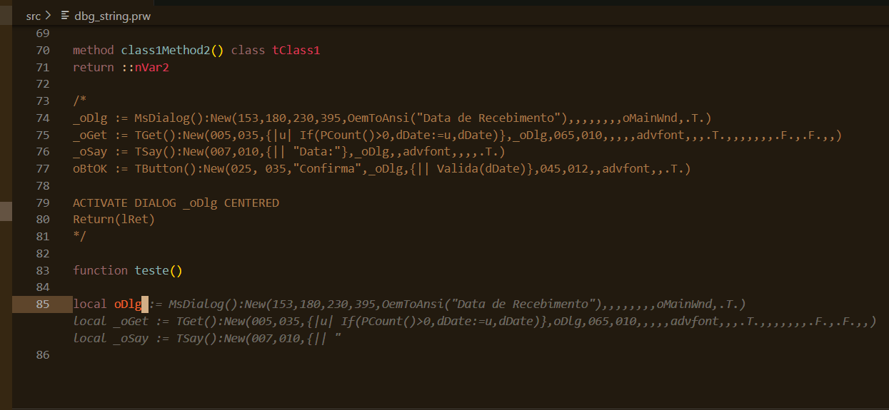
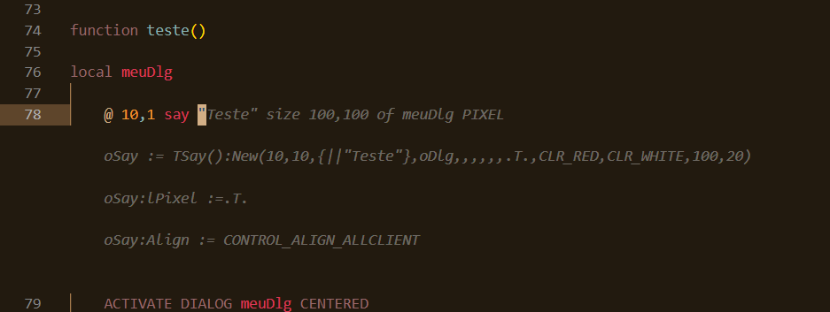
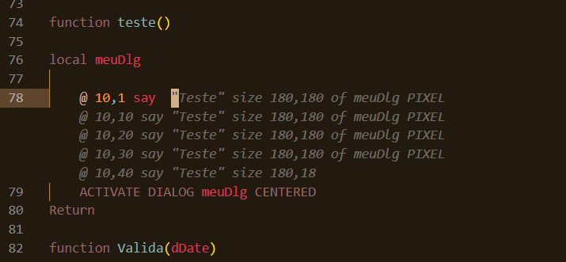
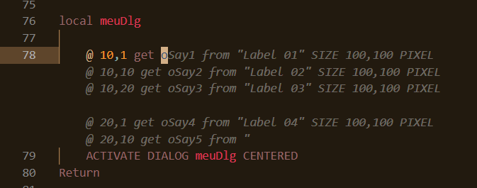
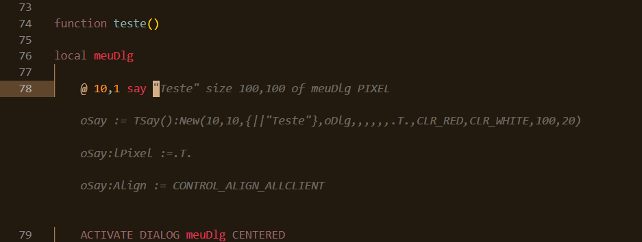
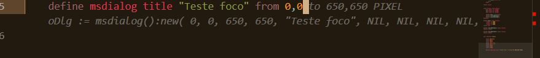
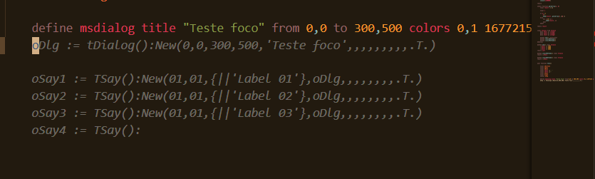
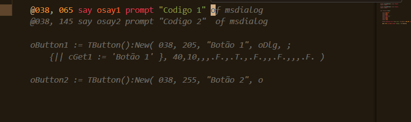
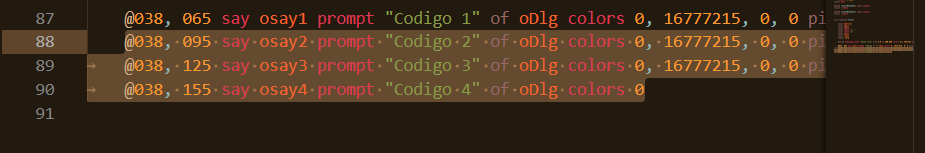
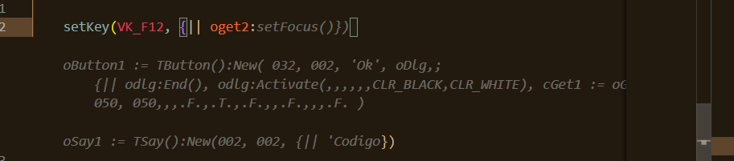

# Relato do uso de IA (29/01/24)

> O termo "estilo do usuário", utilizado neste relatório, refere-se a forma de escrever o código:
> Usando comando:
> ``@ 10,01 say....``
> Ou usando classes/métodos:
> ``oSay := TSay():New(......``

## Resumo

- Códigos sugeridos coerentes, porém divergente do estilo adotado pelo usuário.
- Sem erros de sintaxe (exceto uma ocorrência, ``;`` não é válido).
- Apresenta sugestões que fazem a mesma coisa (ou similar) de formas diferentes (grande frequência).
  Apresentar como mais uma sugestão.
- Sugestões apresentadas, na maior parte das vezes somente a 1ª linha é válida e o restante é descartável ou de baixa usabilidade.
- Retorno como amostra ([_snippets_](https://code.visualstudio.com/docs/editor/userdefinedsnippets)). Por exemplo:

  | Atual | Desejado |
  | --- | --- |
  | ``@ 10,1 say "Teste" size 100,100 of meuDlg``   | ``[`` |
  | ``oSay2:= TSay():New(10, 100, {\|\|'Teste 2}},oDlg,,oFont,,,,.T.,CLR_RED,CLR_WHITE,200,20)`` | ``{`` |
  |                                                 | ``@ ${0:10},${1:1} say ${2:"Teste 1"} size ${3:100}, ${4:100} of meuDlg`` |
  |                                                 | ``@ ${0:10},${1:100} say ${2:"Teste 2"} size ${3:100}, ${4:100} of meuDlg`` |
  |                                                 | ``},`` |
  |                                                 | ``[`` |
  |                                                 | ``{`` |
  |                                                 | ``oSay1:= TSay():New(${0:10}, ${1:1}, {\|\|${2:'Teste 1'}},oDlg,,oFont,,,,.T.,CLR_RED,CLR_WHITE,200,20)`` |
  |                                                 | ``oSay2:= TSay():New(${0:10}, ${1:100}, {\|\|${2:'Teste 2'}},oDlg,,oFont,,,,.T.,CLR_RED,CLR_WHITE,200,20)`` |

## Geral

- Verificado que o retorno hora contém "\n" e outras "\r\n".
  São separadores de sugestões? Senão, padronizar para "\n".
- Ao atingir limite de _tokens_, pode ocorrer do comando vir "quebrado".
  Deve-se limpar essa última linha? Quem?
  Possibilidade de limitar resposta em número de linhas e não _tokens_.
- A expressão "outra amostra", que uso, presume que o IA é capaz de gerar mais de uma resposta para o mesmo contexto. É possível o retorno do tipo vetor, onde cada elemento é uma sugestão?

## Identificadores em geral

> NOTA: Em conversar com a equipe foi estabelecido como alvo o TLPP.
> Desconsiderar esse tópico.


Em AdvPL, somente os 10 primeiros caracteres de um identificador são considerados, por isso ocorreu erro na definição do segundo método da classe acima. Exceto quando a classe é derivada de ``LongClassName``.

Já em TLPP, não há essa limitação. É possível considerar a extensão no momento de sugerir identificadores? Sugiro um parâmetro lógico que indica se é ou não TLPP.

## Código obsoleto

Exitem funções que são obsoletas, porém não foram removidas por questões de compatibilidade e por ainda estar em uso em grande parte  de fontes.

Teria uma forma do IA indicar que o código gerado contem essas funções obsoletadas ou até mesmo evitar o seu uso, usando as recomendadas?

Isso talvez possa ser efetuado através de uma lista a ser passada ao modelo.

## Considerando código comentado



- Resultado coerente com o fonte
- Como comentários possuem formato livre (aceitam  qualquer coisa), não deveria ser ignorado? Ou ter peso menor e ser apresentado como outra sugestão?.

## Considerar estilo



- Resultado coerente com AdvPL e correto (usou ``meuDlg`` e não variável genérica). (Y)
- Fou utilizado o formato de comando (``@..say``) e apresentado com uso de funções (``TSay()``). Não respeitou o estilo do usuário.



- Resultado coerente com AdvPL e correto (usou ``meuDlg`` e não variável genérica). (Y)
- Em um segundo teste, respeitou o estilo do usuário.
  Unificar os resultados (mais de uma amostra no retorno do IA), uma com  o estilo do usuário e outra usando funções.

**Observações:**
Mesmo teste e dados como contexto, com resultados diferentes.

### Várias sugestões

Durante os testes, percebi que as "linhas" vem separadas por um duplo "\n".
Isso é proposital, um separador de sugestões, decorrência dos dados usados no treinamento?

### Comando incompleto

Foi sugerido e aceito, o bloco:

```code
 @ 10,1 say "Teste" size 100,100 of meuDlg;

 @ 10,100 say "Teste" size 100,100 of meuDlg;

 @ 10,200 say "Teste" size 100,100 of meuDlg;

 @ 10,300 say "Teste" size 100,100 of meuDlg;

 @ 10,400 say "Teste" size 100,10
 ```

A última linha esta incompleta devido ao limite de tokens imposto, o que esta correto. Se continuar usando o IA, ele complementa corretamente.

As sugestões estão finalizadas com ``;``, que indica continuação de linha de código. Nesse caso, não apresentou erro de sintaxe pois veio com ``\n\n``. Se viesse com um, o erro de sintaxe seria gerado.
E esse estilo de codificação (finalizar com ``;`` e deixar uma linha em branco) não é algo comum.

**Observação:** Há situações, por exemplo pseudo funções e macros, onde o uso de ``;`` é permitido.

### Resultados diferentes para (quase) mesmo contexto



Ao usar o comando ``@..get``, um dos retornos do IA foi o acima que não respeita o estilo de programação. Ou usa-se comando ou classe.

Na mesma linha, foi adicionado espaço e o retorno foi outro.


Se tirar o espaço, vem somente uma linha (errada). A cada alteração de colocar e tirar espaço, vem sugestões distintas.

### Destaques na sessão



- Código coerente para complemento.


- Código coerente para complemento (1a linha da amostra), correto.
- Faz a mesma coisa, mas de outra forma. Estilo do usuário. Deveria ser uma 2ª amostra.
  Como esta o retorno hoje, não consigo identificar isso.



- Código coerente para complemento (1a linha da amostra), correto.
- Faz a mesma coisa, mas de outra forma. Estilo do usuário. Deveria ser uma 2ª amostra o bloco ``oDlg := msDialog()...



- Sugestão é a mesma coisa da linha anterior (``define msdialog...``). O que seria possivelmente útil da 2ª linha em diante.


- Código coerente para complemento (1a linha da amostra), correto.
- Faz a mesma coisa, mas de outra forma. Estilo do usuário.



- Código coerente para complemento, correto.



- Código coerente para complemento, porém sem utilidade.
  O ideal é ter várias amostras.



- Código coerente para complemento, correto.
  A 1ª linha veio correto e até como esperado (único acerto com minha lógica). As demais, são dispensáveis ou outra amostra.

### Sessão de codificação

Abaixo, a gravação (editada) da sessão de codificação relatada:

> Se preferir, baixe a versão [mp4](./video://).


## Sugestões/questionamentos

### Sugestões de estilo

Configuração na requisição para  definir a preferência por comandos no lugar de funções (estilo do usuário).

Quando escolhido o estilo por comandos, dar prioridade ao uso dos comandos definidos em ``#command|#xcommand|#translate|#xtranslate``.

### Análise de código

Opção que analise o fonte e faz sugestões de melhorias ou potenciais problemas. Já temos alguma coisa no ``IA``?

#### ``#define``

Um exemplo é quando for utilizado valores absolutos na definição de cores.

``@ 038, 065 SAY oSay1 PROMPT "Código 1" SIZE 049, 007 OF oDlg COLORS 0, 16777215 PIXEL
``

Neste trecho, sugerir a troca de ``0, 16777215``, pelas suas contantes definidas em um arquivo de definição, no caso ``color.ch``.

Essa sugestão se aplicaria a constantes em geral determinadas pelo comando ``#define``.

#### Pseudo funções

Dado um exemplo simples, como:

``#define max(A,B) iif(A < B, B, A)``

Se usuário codificar:

``c := iif(A < B, B, A)``

Recomendar:

``c := min(A,B)``

#### Potenciais erros

Usuário codifica:

``hFile := fopen("arquivo.txt", "w")``

Recomendar:

```code
hFile := fopen("arquivo.txt", "w")
if hFile < 1 
  conout("Não foi possível abrir o arquivo. FError: " + str(FError()))
endif
```

Ou mesmo, proteger código com ``begin sequence..end sequence`` no caso de AdvPL e ``try..catch`` para TLPP.

#### Sugerir validação de parâmetros ou definição de valores padrão

```code
user function TSay(oDlg, sMsg, sPrompt, iSize, iColor)

...

return
```

Sugerir:

```code
//código não correto, apenas ilustrativo
user function TSay(oDlg, sMsg, sPrompt)
  default sMsg := ""
  default sPrompt := ""  
  assert(oDlg, "oDlg: Parâmetro requerido)

...

return
```

#### Reaproveitamento de código (esse não vi em nenhum outro IA)

```code
user function minhaFuncao(p1,p2,p3,...,pN)
...
  if p1 == 1 
    conout("Parametro p1 com 1")
  endif
  if p2 == 2 
    conout("Parametro p2 com 2")
  endif
  if p3 == 3 
    conout("Parametro p3 com 3")
  endif
  ...
  if pN == N 
    conout("Parametro pN com N")
  endif
...
```

Sugerir:

```code
user function minhaFuncao(p1,p2,p3,...,pN)
...
  //cria um codeBlock, semelhante a _lambda_ do c++
  //"_lambda_" existe a mais de 30 anos no AdvPL ;)
  local cb := {|paramName, param, expectedValue| ;
    if param == expectedValue,;
      conout("Parametro " + paramName + " com " + str(param)),;
    endif;
  }

  eval(cb, p1, 1)
  eval(cb, p2, 1)
  eval(cb, p3, 3)
...
  eval(cb, pN, N)
...

return
```

Para esclarecimento, a função ``eval`` é uma função que recebe um ``codeBlock`` e executa o mesmo. O código a ser executado usa ``,`` como terminador de linha e para clareza do código, usando ``;`` para indicar que continuamos a atribuição.

Essa mesma linha, pode ser escrita:

```code
  local cb := {|paramName, param, expectedValue| if param == expectedValue, conout("Parametro " + paramName + " com " + str(param)), endif }
```
