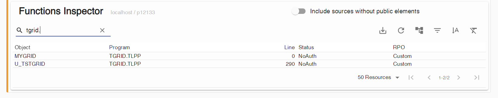
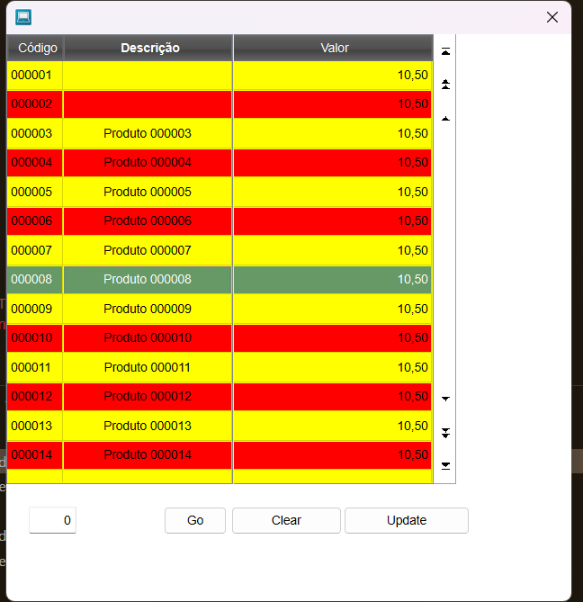

# Relato de conversão de Adv/PL em TLPP (02/02/24)

## Resumo

- Utilizado como base para conversão fonte exemplo disponível em [Classe TGrid](https://tdn.totvs.com/display/tec/TGrid).
- Os métodos e propriedade de uma classe em TLPP possuem o escopo ``PRIVATE`` como padrão, sendo necessário adicionar o escopo ``PUBLIC`` em todas as prototipação de métodos e propriedades para que mantenham compatibilidades com AdvPL.

## Validação do exemplo

Após transferir o exemplo para ambiente [local](./tgrid.prw) e convertido para CP1252, o mesmo foi validado por compilação.
A execução ocorreu como esperado, gerando o diálogo com o [_grid_ customizado](./grid.png).

## Preparo do ambiente

Na tentativa de remoção do fonte ``tgrid.rpo``, a fim de evitar erros de duplicidade de definição. Porém, o procedimento realizado via ``Delete file/resource from RPO`` gerou erro, não removendo o fonte.

  

No _log_ de console, não há informações relevantes e no _log_ da extensão:

```
[Info  - 3:50:25 PM] Starting program deletion.
[Info  - 3:50:25 PM] Starting build for environment p12133.
[Info  - 3:50:28 PM] Starting build using RPO token ...
[Error - 3:50:28 PM] One or more programs could not be deleted from RPO. Server returned: No programs are removed.
[Info  - 3:50:28 PM] Aborting end build (rollback changes).
```

No _log_ do LS:

```
(  32.175s) [languageServer  ]       queue_manager.cc:187   | Handler found for message method '$totvsserver/deletePrograms'
(  32.176s) [languageServer  ]      message_handler.h:70    | > [$totvsserver/deletePrograms] (start) 
(  32.176s) [languageServer  ]msg_totvsserver_delete_:50    | DeletePrograms : with connectionToken djM6MGxkdG9xZjNidW9scndiOG03cX..., environment p12133, programs size 1
(  32.176s) [languageServer  ]  connection_manager.cc:5147  | Searching for connection token: ???????????????????...
(  32.176s) [languageServer  ]  connection_manager.cc:5152  | Connections thread size: 1
(  32.176s) [languageServer  ]  connection_manager.cc:5162  | connection pointer address 000002ACE655CB10
(  32.176s) [languageServer  ]  connection_manager.cc:2558  | retrievedConnectionThread status 2
(  32.176s) [languageServer  ]  connection_manager.cc:4437  | Starting build for environment p12133.
(  35.327s) [languageServer  ]  connection_manager.cc:2589  | MS_DBGDELPRG FAILED with error message: No programs are removed.
(  35.327s) [languageServer  ]  connection_manager.cc:4595  | Aborting end build (rollback changes).
(  35.342s) [languageServer  ]  connection_manager.cc:4600  | MS_DBGENDBUILD OK with abort set to TRUE
(  35.342s) [languageServer  ]               timer.cc:42    | [perf] ConnectionManager DeletePrograms server error took 3166.3163259 ms
(  35.342s) [languageServer  ]      message_handler.h:75    | < [$totvsserver/deletePrograms] (finish)  (316 ms)
(  35.342s) [languageServer  ]       queue_manager.cc:195   | Run finishied message method '$totvsserver/deletePrograms'
```

> Após desabilitar o _token de rpo_ no ambiente e reiniciado o VS-Code, o procedimento de remoção foi executado com sucesso.
> _NOTA:_
> . Melhorar as notificações ao usuário. Não é claro o motivo do erro.  
> . Adicionar notificação para reiniciar o VS-Code após limpar/desabilitar o _token de rpo_. Acregaia que uma reconexão com o _appServer_ também resolva.

## Mudando a extensão do arquivo (PRW para TLPP)

Foi modificada a extensão do arquivo ``tgrid`` de ``.prw`` para ``.tlpp``, submetido a compilação que não apresentou nenhuma ocorrência.



## Teste de execução

Ao executar o exemplo em TLPP, ocorreu erro de execução:

```
THREAD ERROR ([83476], acandido, SPON010124835)   02/02/2024 16:46:56
Invalid call to a PRIVATE method named  NEW on MYGRID:NEW(TGRID.TLPP) 02/02/2024 15:43:37 line : 316

[TOTVS build: 7.00.210324P-20231005]
Called from U_TSTGRID(TGRID.TLPP) 02/02/2024 15:43:37 line : 316
```

Foi necessário adicionar ao método ``New`` o escopo ``PUBLIC``. Nova execução, novo erro:

```
THREAD ERROR ([108432], acandido, SPON010124835)   02/02/2024 16:54:54
Invalid call to a PRIVATE data named  ADATA on {|o| { Self:aData[              1,1], Self:aData[              1,2], Self:aData[              1,3] } }(TGRID.TLPP) 02/02/2024 16:49:23 line : 254
```

Após adicionar a propriedade  ``aData`` o escopo ``PUBLIC``. Nova execução, novo erro:

```
THREAD ERROR ([32020], acandido, SPON010124835)   02/02/2024 17:04:00
Invalid call to a PRIVATE method named  SETFREEZE on MYGRID:SETFREEZE(TGRID.TLPP) 02/02/2024 17:00:56 line : 317
```

E "assim segue a humanidade..."

## Compatibilizando classe AdvPL com classe TLPP

Foi adicionado em todas as propriedades e métodos o escopo ``PUBLIC``, recompilado e executado. Desta vez a execução ocorreu como esperado.


