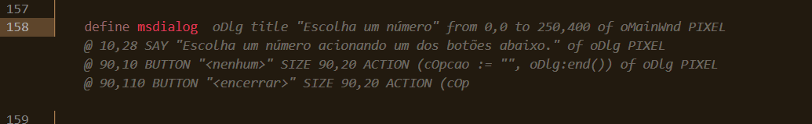
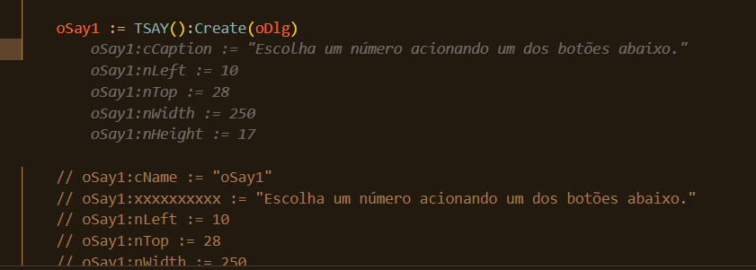
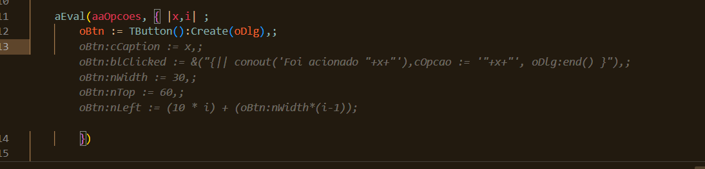
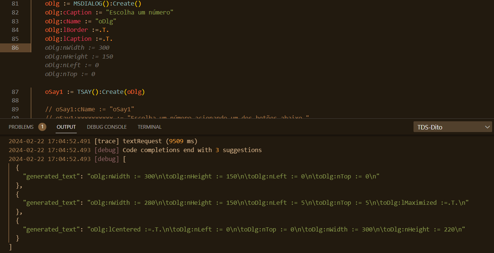
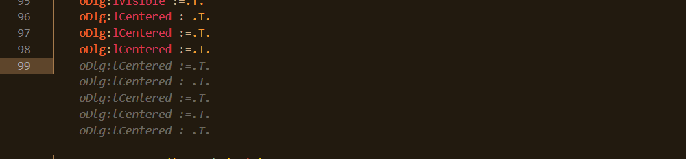
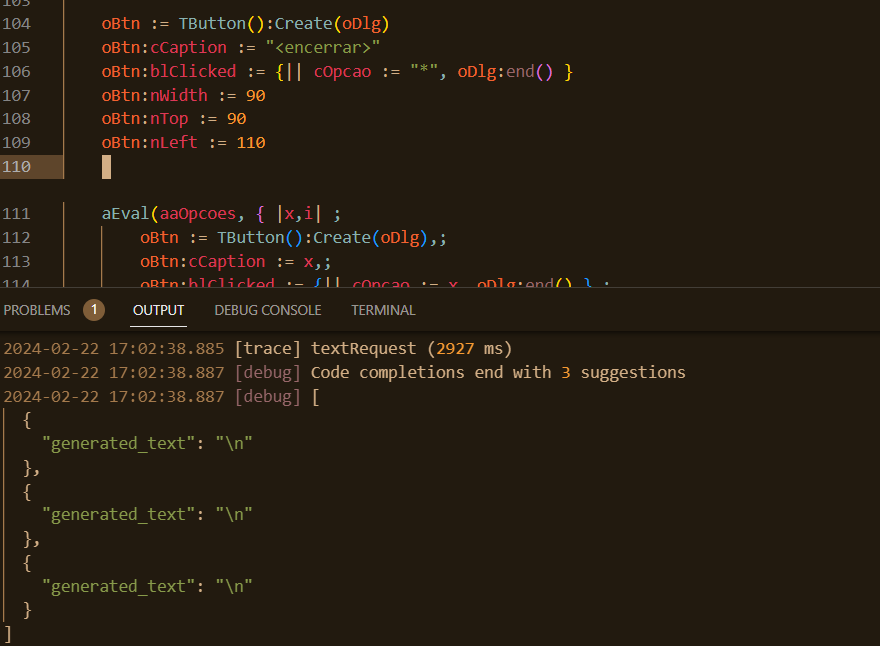
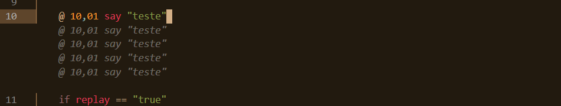

# Relato de testes com IA (22/02/24)

## Resumo

- Utilizado nova [URL](https://advpl.ds.dta.totvs.ai)
- O formato do retorno da API ``complete`` ficou bom e fácil de usar`
- Parece que o IA está conseguindo detectar o estilo (orientado a objetos ou comandos) e apresentar sugestões coerentes com o estilo.
- Parece que o IA está conseguindo **aprender e evoluir** a cada interação.
- Eliminado efeito de colocar/tirar espaços (na versão anterior, ao adicionar/retirar um espaço, as sugestões eram diferentes).
- Em relação a versão anterior:
  - Retorno da API ``complete`` limpo, ou seja, sem ``\n`` em excesso e padronizado;
  - Sugestões seguindo o mesmo estilo e padrões de código do código existente;
  - Sem truncamento de linhas (limite de _tokens_ na anterior)

## Comentários

- Padronizar o retorno das API (sempre JSON). A ``health`` retorna texto bruto.
  Sugiro colocar também algo como "em manutenção", com previsão de término, como uma das resposta desta API.

- ~~Retorno aparenta estar mais rápido.
  Na versão anterior não fiz medições, portanto é _sentimento_ e passarei a fazê-las, nesta versão e próximas.~~

- Após análise mais cuidadosa, devido ao uso de ``Promise`` no processo de comunicação com a IA que mascara o tempo real, os tempos de execução da API ``complete`` ficam entre 15 e 20 seg, com acesso via WI-FI. Via cabo, entre 10s e 13 seg.

## Destaques

### Respeito ao _estilo_




### Código comentados estão sendo ignorado (ou não?)



> **NO TREINAMENTO** foi usado um fonte de nome ``escolheNUm.prw``?
> ESTOU SURPRESO:
> Código comentado está sendo considerado pelo IA e **corrigindo** (aparenta);
> **Ou** está usando alguma tipo de "memória", pois utilizei esse fonte diversas vezes;
> **Ou** inspirou-se no código OOP que esta nesse mesmo fonte.
> Parece que o IA está conseguindo **aprender** e evoluir a cada interação.

### Gerando _codeblock_



| Escrito | Gerado |
| ------- | ------ |
|``aEval(aaOpcoes, { \|x,i\|;``| |
|  ``oBtn := TButton():Create(oDlg),;``| |
|  ``oBtn:cCaption := x,;``| ``oBtn:cCaption := x,;`` |
|  ``oBtn:blClicked := &("{\|\| conout('Foi acionado "+x+"'),cOpcao := '"+x+"', oDlg:end() }"),;`` |   ``oBtn:blClicked := &("{\|\| conout('Foi acionado "+x+"'),cOpcao := '"+x+"', oDlg:end() }"),;`` |
|  ``oBtn:nWidth := 30,;`` | ``oBtn:nWidth := 30,;`` |
|  ``oBtn:nTop := 60,;`` | ``oBtn:nTop := 60,;`` |
|  ``oBtn:nLeft := (10 \*i) + (oBtn:nWidth\*(i-1));`` | ``oBtn:nLeft := (10 \*i) + (oBtn:nWidth\*(i-1));`` |
|  ``})`` | ``})`` |

> SURPRESO: O código é o mesmo. Aparenta ter reaproveitado o código existente na função que usa OOP (mesmo fonte).

Removi a parte com OOP e refiz a operação para gerar o _codeblock_. Não foi o mesmo, mas é útil nesse contexto, necessitando ajustar o que esta destacado.

```code
 aEval(aaOpcoes, { |x,i| ;
  oBtn := TButton():Create(oDlg),;
  oBtn:cCaption := x,;
  oBtn:blClicked := {|| cOpcao := x, **oDlg:end()** },;
  oBtn:nWidth := 90,;
  **oBtn:nTop** := 90 + (i * 30),;
  **oBtn:nLeft** := 10;
})
```

> O IA conseguiu identificar o padrão de código (geração de botões dinâmicos) e utilizar os métodos corretamente e a sintaxe (continuação de linha), para gerar o código do _codeblock_.
> E apresentou outras sugestões, variando o tamanho e posição dos botões.

### Mais propriedades

No ``dialog``, foi apresentado sugestão de propriedades (aparentam estar corretas).



Fiquei acionando o ``tab`` para aceitar e continuar solicitando novas sugestões, que foi atendido prontamente com mais propriedades. Repeti o ciclo várias vezes, até que começou a apresentar repetições (propriedades já atribuídas).



No caso do ``button``, isso não ocorreu.


### @..say

No comando ``@..say``, especificamente, as sugestões apresentas são mais simples em relação a versão anterior.

Anterior:


Atual:


## Refinamento


Após indicar fim de classe (``end class``), uma das sugestões foi a prototipação de métodos.
