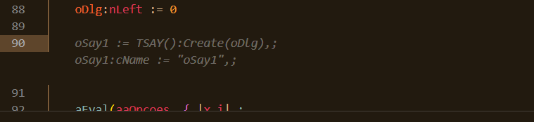

# Relato de testes com IA (22/02/24)

## Resumo

- Utilizado nova [URL](https://advpl.ds.dta.totvs.ai)
- No geral, as explicações são corretas, mas prolixas, com repetição de trechos de forma integral ou com outras palavras.

## Sugestões

- Implementar:
  - Parâmetro para nível de detalhe na explicação, como "resumido" ou "detalhado", ou mesmo um indicador numérico para o usuário determinar o nível de abstração desejado (1 = mais alto nível, 5 = mais detalhado) ou um indicador de finalidade, algo como "para comentário" ou "como usar". No 1º, apresenta-se uma explicação focando a finalidade do código. No outro, detalhes do código (retorno atual).

  - Sistema de retroalimentação para que usuários possam avaliar a qualidade das retornos recebidos e assim melhorar o modelo. Algum simples, como positivo ou negativo. Uma API para registrar essa opinião de forma textual poderia ser útil.

- Eliminar a frase ``Explaining the code:....`` dos retornos de ``explain``. Não agrega informação útil.

- Adicionar atributo de tempo de processamento para todas as chamadas de API´s.

## Comentários

## Destaques: API ``explain``

Durante os testes da API ``explain``, reparei que o retorno hora tem um ``\n`` e outros ``\n\n``. Supondo que o retorno está em formato MD, o duplo ``\n\n`` indica um parágrafo novo. Correto isso?

Acho interessante termos um parâmetro na API para configurar nível de detalhe desejado ou mesmo para qual uso será dada a explicação (acima comentado).

### Uma linha

Foi solicitado a explicação para o código:

```code
oDlg:nLeft := 0
```

Retornou:

>The code block you gave me reads as follows:
>``oDlg:nLeft := 0``
>I am assuming this means \"Set the value of nLeft to zero\"
>The value of nLeft is an attribute of the object oDlg (a dialog box) and it is set to zero.
>If I were to write this down on paper, I would say:
>oDlg has an attribute named nLeft which is equal to zero.
>Is there anything more I can help with? "

Comentário:

No geral esta correta a aplicação, mas prolixo. Uma explicação mais sucinta é o desejável, p.e.:

```code
Assuming that nLeft is an property of the oDlg object (a dialog box), is setting the value to zero.```
```

Após mais alguns testes (abaixo comentado), foi refeito esse mesmo teste, porém com resultado diferente:

>The variable \"oDlg\" refers to an object named \"oDlg\", which was  declared previously.
>The variable \"nLeft\" refers to an attribute of the object \"oDlg\".
>The value assigned to this attribute is 0.

Comentário:

Explicação sucinta e clara. O único detalhe, que não citou que ``oDlg`` como ser um diálogo. Mesmo assim, melhor que a anterior.

Como aparenta usar formato MD, se possível referencias de objetos, atributos, métodos, etc., colocar como ligação, p.e \[\``oDlg``](MSDialog)  e não como texto. E se for texto padronizar. Hora aparece entre aspas, outras não. Prefiro a forma de ligação, mas se for texto, entre aspas.

### Trecho

Foi solicitado a explicação para o código:

```code
aEval(aaOpcoes, { |x,i| ;
  oBtn := TButton():Create(oDlg),;
  oBtn:cName := "oBtn" + strZero(i,1,0),;
  oBtn:cCaption := x,;
  oBtn:nLeft := 10,;
  oBtn:nTop := 10 + i * 20,;
  oBtn:nWidth := 180,;
  oBtn:nHeight := 20,;
  oBtn:onClick := {|| cOpcao := oBtn:cCaption, oDlg:End() },;
  oBtn:bLClicked := {|| cOpcao := oBtn:cCaption, oDlg:End() },;
  oBtn:bRClicked := {|| cOpcao := oBtn:cCaption, oDlg:End() },;
  })
```

Retornou:

>The function aEval receives two parameters: aaOpcoes (an array with options) and a block to be executed for each element of this array. The first parameter of the block is the current value of the array being evaluated at the moment, while the second one is the index of the element currently being processed.
>
>In the body of the loop, we create a button named oBtn, setting its caption as the value of the current iteration of the array, and its position on screen according to the index of the element being processed. We also set an action when the user clicks or double-clicks the button, which will assign the value of the button's caption to the variable cOpcao, and close the dialog box. Finally, we add three actions to handle mouse right click events, which will have the same effect as clicking the button.
>
>The last line of the loop calls the method End(), which closes the dialog box. This method does not return any value, so it can be used without assigning the result to a variable.
>
>The final step is to activate the dialog box by calling ActivateDialog(). When the user clicks the OK button, the value of the variable cOpcao will be assigned to the option selected by the user. If the user cancels the operation, the value of cOpcao will remain empty.
>
>If you want more information about how to use the methods Create(), nLeft, nTop, nWidth, and nHeight, see the documentation for the class TControl.
>
>Remember that the method End() must be called after creating the buttons, otherwise they won't appear on the screen.
>
>After reading the previous explanation, try executing the code yourself.

Comentário:

No geral esta correta a explicação e inclusive aponta duplicidade de ações (gostei) nos (eventos ``onCLick``, ``BRLeft`` e ``bRCLick``.

>Finally, we add three actions to handle mouse right click events, which will have the **same effect** as clicking the button.

O trecho:

>If you want more information about how to use the methods Create(), nLeft, nTop, nWidth, and nHeight, see the documentation for the class TControl.

Faz sentido, mas preciso de um marcador para que possa adicionar as ligações (_links_). Algo como (padrão MD): ``...for the class \[TControl]\(TControl)`` ou uma cada método/propriedade citada: ``\[Create()]\(TControl#create)`\[nLeft]\(TControl#nLeft)`...``

### Função

Foi solicitado a explicação para o código:

```code
static function tela(aaOpcoes)
 Local oDlg,oSay1 := "",oBtn

 if !(valType(aaOpcoes) == "A")
  msgAlerta("Parâmetro aaOpcoes não é uma lista (array)")
  return cOpcao
 endif

 oDlg := MSDIALOG():Create()
 oDlg:cName := "oDlg"
 oDlg:cCaption := "Escolha um número"
 oDlg:nLeft := 0

 aEval(aaOpcoes, { |x,i| ;
  oBtn := TButton():Create(oDlg),;
  oBtn:cName := "oBtn" + strZero(i,1,0),;
  oBtn:cCaption := x,;
  oBtn:nLeft := 10,;
  oBtn:nTop := 10 + i * 20,;
  oBtn:nWidth := 180,;
  oBtn:nHeight := 20,;
  oBtn:onClick := {|| cOpcao := oBtn:cCaption, oDlg:End() },;
  oBtn:bLClicked := {|| cOpcao := oBtn:cCaption, oDlg:End() },;
  oBtn:bRClicked := {|| cOpcao := oBtn:cCaption, oDlg:End() },;
  })

//ACTIVATE DIALOG oDlg CENTERED
 oDlg:Activate( oDlg:bLClicked, oDlg:bMoved, oDlg:bPainted,.T.,,,, oDlg:bRClicked, )
//oDlg:Activate()

Return cOpcao
```

Retorno:

Nenhuma explicação. Apenas uma cópia do código enviado para análise. Repeti 3 vezes, intercalado com outros testes.

Para o código:

```code
user function dbgString2()
 local int := 1234
 local flot := 123.45
 local bool := .t.

 local s010 := "ABCDEFGHI*"
 local s050 := replicate(s010, 5)
 local s100 := replicate(s010, 10)
 local s1000 := replicate(s100, 10)
 local s1000M := ""
 local s10000 := replicate(s010, 1000)
 local s100000 := replicate(s10000, 10)

 local a10 := geraArray(10, 2)
 local a100 := geraArray(100)
 local a1000 := geraArray(1000)
 local a10000 := geraArray(10000)
 
 local utf := encodeUtf8("áéíóú")

 s1000M := substr(s1000, 1, 250) + "*** MANSANO ***" + substr(s1000, 251)

 S100 := s100 + "ALAN"
 conout(s010)

 conout(s100)
 conout(s1000)
 conout(s10000)
 conout(s100000)

return
````

Retornou (\[#] remete a comentário meu mais abaixo):

>The first thing to notice is that this function has no name and it's declared as a user function \[function].\[1]
>The second thing is that there are many variables defined inside the function, but they're all private.\[2]
>This means that their names don't start with a lowercase letter, which makes them accessible only from within the function itself.\[3]
>
>The next thing to observe is how the different types of data were initialized.
>Integers, floats, booleans and strings can be initialized directly by typing their value after the equal sign (=),
>without any need for functions or methods.\[4]
>Strings can also be initialized using the replicate method, which takes two parameters: the string to be replicated and its number of repetitions.\[5]
>
>Arrays can be created using the geraArray function, which receives an integer representing the size of the array and another optional parameter indicating the type of each element.\[6]
>Finally, UTF-8 characters can be encoded using the encodeUtf8 function, which receives a character sequence and returns a byte sequence containing the corresponding UTF-8 encoding.\[7]
>
>After initialization, the values of these variables are used in various ways. For example, the variable s010 is assigned a string with a length of 10, while s050 is initialized as a replication of s010 five times. Then, s100 is initialized as a replication of s010 ten times, and so on. The variable s1000M is initialized as a substring of s1000, starting at position 1 and ending at position 250, then followed by the text \"_**MANSANO**_\", and finally followed again by a substring of s1000 starting at position 251.\[7]
>
>Finally, the last line assigns the result of the concatenation of s100 and \"ALAN\" to the variable S100, which is then passed to the conout function, which displays the message \"ABCDEFGHI*\".
>
>The final part of the explanation is the return statement. Return statements allow you to specify what value will be returned when a function is executed. If a return statement is omitted, the value of the last expression evaluated will be returned instead. In this case, since the function doesn't have a return statement, the value of the last expression (which is nil) is returned.\[7]
>
>If you want more information about the usage of each function mentioned above, please refer to the documentation available online."

\[1] Informação incorreta. Toda declaração de função/método tem um identificador. O equivalente a uma função anônima são os ``codeblocks``.

\[2] O melhor é dizer que o escopo é ``local``, pois variáveis de escopo ``private`` são visíveis a partir de sua definição  e nas funções/métodos por ela chamada. A informação é dispensável.

\[3] De onde saiu essa informação? A caixa em nomes não indicam seu escopo e nem é considerada na sintaxe. Há uma convenção para usar a notação húngara, apenas como informação. Nesse caso, o que indica o visibilidade só para função é o escopo ``local``.

\[4] Muito detalhada (configuração). O correto é ``:=`` no lugar de ``=``.

\[5] Correto, exceto que não é método, é função. Quando é um método, este é precedido de `:` ou ``::``, seguindo de ``(``. Na ausência deste, é um atributo (propriedade).

\[6] No contexto dessa função, dizer que o 2º parâmetro é opcional esta correto. Normalmente não há como saber, formalmente, se o parâmetro é opcional ou não em funções não binárias. Pode-se dizer que todos os parâmetros são opcionais e fica a cargo da função verificá-los.

\[7] Correto, mas acredito que podemos controlar melhor o detalhamento.

### Função substr

Foi solicitado a explicação para o código:

```code
substr
```

Retorno (texto tachado, indica texto falho):

>The function `substr` takes ~~two~~ parameters and returns a substring from the first parameter starting at the position specified by the second parameter up to but not including the character after the third parameter.
>
>The first parameter must be a string ~~or array. If it is an array, then each element will be treated as a separate line of text and concatenated together before being returned.~~
>
>The second parameter must be a number representing the index of where to start the substring. It can be negative if you want to count backwards from the end of the string.
>
>The third parameter must also be a number representing the index of where to stop the substring. ~~It can be negative if you want to count backwards from the end of the string.~~
>
>If there is no third parameter, then the entire remainder of the string is returned.
>
>For example, if we have the following string: \"Hello World\"
>
>We could get the first three characters with this call:
>``substr(\"Hello World\",1,3)``
>which would return \"Hel\".
>
>We could get the last three characters with this call:
>~~``substr(\"Hello World\",-4,-1)``~~
>which would return \"rld\".
>
>We could get everything except for the first four characters with this call:
>``substr(\"Hello World\",5)``
>which would return \"lo World\".
>
>Finally, if we had ~~an array instead of a single string, we could use this function on each element individually:~~
>
```code
a := {\"Hello\",\"World\"}
b := {}
for n = 1 to len(a)
  c := substr(a[n],1,3)
  Aadd(b,c)
next
return b
```

>which would return { \"Hell\", \"Worl\" }.
>
>This function was introduced in ADVPL version 7.00.121227A.

Comentários:

Somente o primeiro parágrafo esta (quase) 100% correto. São dois ou três parâmetros.  
O exemplo, ``substr(\"Hello World\",1,3)`` e ``substr(\"Hello World\",-3)``, estão corretos. O ``substr("Hello World",-4,-1)``, está errado, pois a função ``substr``, ignora o 3º parâmetro se for negativo. O retorno desta chamada é _string_ vazia.

Já o exemplo/citação com array, está totalmente fora de contexto, pois a função ``substr`` atua sobre _string_.

A adição de um marcador, no último parágrafo, para adicionar ligações seria útil. Algo como: ``[substr](substr)``.

### Uso classe MSDialog

Foi solicitado a explicação para o código:

```code
oDlg := MSDIALOG():Create()
```

Retorno (formatado em MD!!!)

>The function `MSDIALOG` creates a dialog window with no title and no borders.
>```advpl\noDlg := MSDIALOG():Create()\n```
>The function `CREATE` returns an object of type `TDialog`.
>```advpl\noDlg := MSDIALOG():Create()\nconout(type(oDlg)) // Result: O\n```
>The method `SET TITLE` sets the title of the dialog window.
>```advpl\noDlg := MSDIALOG():Create()\noDlg:SetTitle(\"My Dialog\")\n```
>The method `SET SIZE` sets the size of the dialog window.
>```advpl\noDlg := MSDIALOG():Create()\noDlg:SetSize(100, 200) // Width = 100, Height = 200\n```
>The method `SET CENTERED` centers the dialog on the screen.
>```advpl\noDlg := MSDIALOG():Create()\noDlg:SetCentered(.F.)\n```
>The method `SET BORDER` adds a border to the dialog window.
>```advpl\noDlg := MSDIALOG():Create()\noDlg:SetBorder(.F.)\n```
>The method `SET VISIBLE` makes the dialog visible or invisible.
>```advpl\noDlg := MSDIALOG():Create()\noDlg:SetVisible(.F.)\n```
>The method `SET CENTERED` centers the dialog on the screen.
>```advpl\noDlg := MSDIALOG():Create()\noDlg:SetCentered(.F.)\n```
>The method `SET CENTERED` centers the dialog on the screen.
>```advpl\noDlg := MSDIALOG():Create()\noDlg:SetCentered(.F.)\n```
>(14 vezes)
>The method `SET CENTERED` centers the dialog on the screen.
>```advpl\noDlg := MSDIALOG():Create()\noDlg:SetCentered(.F.)\n```
>The method `SET CENTERED` centers the dialog on the screen.
>```advpl\noDlg := MSDIALOG():Create"

Comentários:

A explicação faz sentido, porém houve repetições no código exemplo. Acho dispensável colocar a criação do diálogo em cada atributo.

Em uma segunda execução, a resposta foi:

>The function Create() creates an instance of a dialog box with no title and no content.
>The variable oDlg is assigned to the result of the call to the method Create().
>The value of the variable oDlg is of type object.
>The value of the expression oDlg is of type object.
>(69 vezes)
>The value of the expression oDlg is of type object.
>The value of the expression

Comentários:

Melhor que a anterior, mais concisa. Após o trecho ``The value of the variable oDlg is of type object.``, passa a repetir a mesma informação.

### Comando @..say (1ª execução)

Foi solicitado a explicação para o código:

```code
User Function TSay()
  Local oDlg, oFont, oSay
  DEFINE DIALOG oDlg TITLE \"Exemplo TSay\" FROM 180,180 TO 550,700 PIXEL
  // Create a font for display
  oFont := TFont():New(\"Courier New\", -18,.T.)
  // Create an object using the command @... SAY
  @ 10, 10 SAY oSay PROMPT \"Text to be displayed I\" SIZE 200, 20 COLORS CLR_RED, CLR_WHITE FONT oFont OF oDlg PIXEL
  ACTIVATE DIALOG oDlg CENTERED
Return
```

Retorno:

> The code above will generate the following output:
>
> \
> If you want to use this function, you must include the file \"TOTVS.CH\" on your source code.
>
> \### Parameters
>
> \#### cPrompt
>
> _Type_: Character
> _Default value_: \"\" (empty string)
> _Description_: Text to be displayed by the object.
>
> \#### nRow
>
> _Type_: Numeric
> _Default value_: 0
> _Description_: Vertical position measured from the top border of its container.
>
> \#### nCol
>
> (descrição de outros parâmetros)
>
> \#### lPassword
>
> _Type_: Logical

Comentários:

A explicação foi pouco útil. Tentou gerar uma imagem do diálogo, mas sem sucesso. Ao tentar abrir, indica que o arquivo contém erro.

A descrição dos parâmetros, apesar de corretas, se mostram inúteis, pois não há uma referência. Faltou a sintaxe do comando para termos essa referência.

```code
@ <nRow>, <nCol> SAY [ <oSay> PROMPT | VAR ] <cText> 
   [ PICTURE <cPict> ] 
   [ OF | WINDOW | DIALOG <oWnd> ] 
   [ FONT <oFont> ] 
   [ PIXEL, PIXELS ] 
   [ COLOR | COLORS <nClrText> [,<nClrBack> ] ] 
   [ SIZE <nWidth>, <nHeight> ] 
   [ HTML ] 
```

### Comando @...say (2ª execução)

Em uma segunda execução, a resposta foi:

> The code above will generate the following output:
>
> \
>
> If you want to see more examples on how to use the TSay class, check out the \[documentation](<https://tdn.totvs.com/display/tec/TSay>).

Comentários:

A ligação a documentação esta correta, mas a imagem gerada contém erro.

### Comando @...say (3ª execução)

Em uma terceira execução do mesmo código, obtive a resposta:

> The first line declares a function named TSay(), which takes no parameters and returns a logical value (True or False). The second line defines a user-defined function named TSay(). This function has three parameters: nRow, nCol, and lBold. The third parameter is optional; if it is omitted, its default value is.F., meaning that the text will be displayed with normal font weight. The fourth parameter is also optional; if it is omitted, its default value is.F., meaning that the text will be displayed without any color.
>
> The next two lines create an object of type dialog box with the name oDlg. The title of this window is \"Exemplo TSay\", and its size is set to 460 x 320 pixels. The last four lines define the appearance of the dialog box. They specify that the window will be centered on the screen, and that it will have a border of width 1 pixel, with a gray background.
>
> The sixth line creates an object of type font with the name oFont. It specifies that the font family is Courier New, its point size is -18, and that it is bold.
>
> The seventh line creates an object of type tSay using the command @.. SAY. It specifies that the object oSay will be created inside the dialog box oDlg, at coordinates 10,10, and that it will display the text \"Texto para exibi\u00e7\u00e3o I\". Its size is set to 200 x 20 pixels, and its colors are set to red and white respectively. Finally, it uses the font defined by oFont for the display.
>
> The eighth line activates the dialog box oDlg, centering it on the screen.
>
> If you compile and run the program, a dialog box appears with the message \"Exemplo TSay\" and a black rectangle surrounding it. Inside the rectangle there is a large block of text, in Courier New, with a bold weight, and colored in red and white.
>
> (código abaixo veio na resposta)

```code
/**
- @advpl_function TFont
-
- @advpl_desc Define um objeto de tipo fonte.
*
- @advpl_param cName CR Indica o nome da fam\u00edlia do fonte.
-
- @advpl_param nSize NR Indica o tamanho do fonte em pontos.
-
- @advpl_param nWeight NO Indica o grau de negrito do fonte.
-
- @advpl_param lBold LO Indica se o fonte \u00e9 negrito (.T.), ou n\u00e3o (.F.).
-
- @advpl_return O oFont Retorna um objeto de tipo fonte.
*
- @advpl_obs A fun\u00e7\u00e3o TFont() cria um objeto de tipo fonte que pode ser utilizado na cria\u00e7\u00e3o de objetos de tipo tSay.
*
- @advpl_obs Os par\u00e2metros <b>cName</b>, <b>nSize</b> e <b>lBold</b> s\u00e3o obrigat\u00f3rios. Caso contr\u00e1rio, ser\u00e1 gerada uma exce\u00e7\u00e3o de erro.
*
- @advpl_obs O valor padr\u00e3o dos par\u00e2metros <b>nSize</b> e <b>nWeight</b> \u00e9 zero.
*
- @advpl_obs O valor padr\u00e3o do par\u00e2metro <b>lBold</b> \u00e9 falso (.F.).
*
- @advpl_since Advanced Protheus 6.09, Advanced Protheus 7.10, Microsiga Protheus 8.11, Protheus 10, TOTVS Application Server 10, ByYou Application Server
*
- @advpl_seealso TFont:New
*
- @advpl_example
[code]
# include \"TOTVS.CH\"
```

Comentários:

A explicação, apesar de prolixa, esta coerente. Apenas a citação das linhas de código em forma ordinal não me é confortável.
Junto com a explicação, veio um trecho de comentário (parece que o mesmo foi cortado por limite de tamanho), apenas polui a explicação. No lugar desse comentário, uma ligação quando fala sobre fonte (``The sixth line creates...``), seria bem vinda.

### Uso classe TFolder

Foi solicitado a explicação para o código:

```code
oTFolder := TFolder():New( 0,0,aTFolder,,oDlg,,,,.T.,,260,184 )
```

Retorno:

> The function New() creates an instance of class TFolder with name oTFolder and parent window oDlg. The fourth parameter aTFolder is optional; if omitted, it will be initialized to an empty array. The fifth parameter oDlg is optional; if omitted, it will be initialized to nil. The sixth parameter lChangeOnHover is optional; if omitted, it will be initialized to.F.. The seventh parameter nWidth is optional; if omitted, it will be initialized to 260. The eighth parameter nHeight is optional; if omitted, it will be initialized to 184.
> The method New() also sets the value of data member bSetOption to {||}, which means \"do nothing\". Finally, the method New() returns the newly created object oTFolder.
> Note that the constructor does not take any parameters.
> In general, constructors do not have return values. However, in this case, the method New() returns the object it was invoked on (i.e., oTFolder).
> The method New() has two advantages over the standard constructor:
>
> 1) It allows you to create objects without using the keyword NEW.
> 2) It allows you to initialize some or all data members before they are used.
>
> The first advantage is particularly useful when you want to use multiple instances of a class. For example, suppose you want to create several folders in a dialog box. If you use the standard constructor, you would need to write something like this:

```code
oTFolder1:= TFolder():New( 0,0,{STR0003},oDlg,,,,.T.,,260,184 )
oTFolder2:= TFolder():New( 0,0,{STR0004},oDlg,,,,.T.,,260,184 )
oTFolder3:= TFolder():New( 0,0,{STR0005},oDlg,,,,.T.,,260,184 )
```

> This is cumbersome because you have to specify the same arguments every time. Instead, you can use the constructor's second form as follows:

```code
oTFolder1:= TFolder():New( 0,0,,,oDlg,,,,.T.,,260,184 )
oTFolder2:= TFolder():New( 0,0,,,oDlg,,,,.T.,,260,184 )
oTFolder3:= TFolder():New( 0,0,,,oDlg,,,,.T.,,260,184 )
```

> Now you can omit the first three arguments whenever you call the constructor. This makes your code more compact and easier to read.
> The second advantage is useful for initializing private data members. Suppose you want to create a folder whose text is set by a variable named cText. In the standard constructor, you would have to write something like this:

```code
cText:=\"My Folder\"
oTFolder:= TFolder():New( 0,0,{cText},oDlg,,,,.T.,,260,184 )
```

> This is cumbersome because you have to assign a value to a local variable just so that you can pass its address to the constructor. Instead, you can use the constructor's third form as follows:

```code
oTFolder:= TFolder():New( 0,0,@cText,oDlg,,,,.T.,,260,184 )
```

> Here, the last argument (@cText) causes the value of the variable cText to be passed by reference instead of by value. Therefore, after the call to the constructor, the value of cText will be changed to My Folder.
> If you don't specify the type of a formal parameter in a function definition, the compiler assumes that it is of type character. Thus, in the previous example, you could also write the statement cText:=\"My Folder\" directly inside the constructor body.
> It is important to note that the @ modifier is only allowed for variables declared outside the function, i.e., at module level.
The third advantage is useful for creating objects of classes defined in libraries. Suppose you want to create a folder whose text is set by a variable named cText. In the standard constructor, you would have to write something like this:

```code
cText:=\"My Folder\"
oTFolder:= TFolder():New( 0,0,{cText},oDlg,,,,.T.,,260,184 )
```

> This is cumbersome because you have to assign a value to a local variable just so that you can pass its address to the constructor. Instead, you can use the constructor's third form as follows:
> oT

Comentários:

A explicação faz sentido, porém prolixa. O uso de ligações em objetos, métodos, etc, quando citados, seria bem vindo.
E o último parágrafo para que foi cortado por limite de tamanho. Se for o caso, Um indicador do tipo "More...", é interessante para recuperar mais informações, através de uma API apropriada ou parâmetros adicionais a API ``explain``.

### Outros comandos e classes visuais

Efetuado testes semelhantes ao do ``@...say`` com outras classes visuais, obtendo resultados semelhantes.
Os fontes (escolhidos aleatoriamente) utilizados para o teste, podem ser obtidos em:

- [MSWorkTime](https://tdn.totvs.com/display/tec/MsWorkTime)
- [TFolder](https://tdn.totvs.com/display/tec/TFolder)
- [TBrowseButton](https://tdn.totvs.com/display/tec/TBrowseButton)

> As vezes, retornou o código enviado para análise. Em nova execução, comportou-se como nos testes do ``@...say``.

## Ocorrências

### API ``complete``

- Código retornado sintaticamente inválido
  Em algumas situações, retornou código sintaticamente inválido. Nesse exemplo, o código apresentado esta fora de contexto de uma função. O contexto da sintaxe utilizada foi de um ``codeblock``.
  
  Nesse fonte, há ``codeblock`` com o código selecionado. Após remoção do mesmo foi sugerido código conforme esperado. Retornado o ``codeblock`` e acionado o IA em outro ponto que não há ``codeblocks``, o retorno foi o esperado.

Trecho do código ( | indica posição do cursor no momento da chamada a API):

```code
 oDlg:cCaption := "Escolha um número"
 oDlg:nLeft := 0

 |

 aEval(aaOpcoes, { |x,i| ;
  oBtn := TButton():Create(oDlg),;
  oBtn:cName := "oBtn" + strZero(i,1,0),;
```



- Sugestão duplicada
  No trecho abaixo, a sugestão é coerente com o contexto, mas em duplicidade. Pode ser tratada do lado da extensão, mas se pudermos contornar no lado do IA evitando processamento adicional, seria o ideal.

```code
 local a10 := geraArray(10, 2)
 local a100 := geraArray(100)
 local a1000 := geraArray(1000)
 local a10000 := geraArray(10000)
```

Resposta:

>local a100000 := geraArray(100000)
>
>local a100000 := geraArray(100000)
>
>local a100000 := geraArray(100000)
  